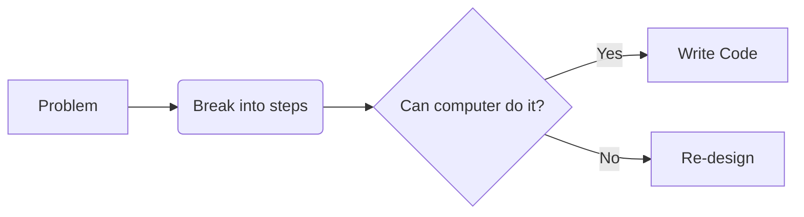

# 🌟 Day 1: Git, GitHub & JavaScript Crash Course

## ⚡ POOL Program Highlights
- **4-day evaluation** with daily challenges
- **Schedule**:
  - Day 1: Onboarding + Challenge 1
  - Day 2: Course + Challenge 2
  - Day 3: Group Work + Presentation
  - Day 4: Final Group Assessment
  - Day 5: Public Speaking Practice
- **Goal**: Showcase skills → Earn bootcamp spot! 🚀

## 🔄 Version Control = Time Machine for Code!
- **Why?** 
  - 🧑‍🤝‍🧑 Collaborate without chaos
  - ⏪ Revert mistakes ("Oops button")
  - 🧪 Experiment safely (feature branches)
- **Git** = Most popular system (created by Linux founder!)

## 🐙 Git Essentials Cheat Sheet
```bash
# Start tracking
git init  # 📦 Create memory card for project

# Daily workflow
git status      # 🕵️‍♀️ See what changed
git add .       # 📦 Pack changes for shipping
git commit -m "Message"  # 📸 Take snapshot

# Connect to GitHub
git remote add origin <URL>  # 🔌 Plug into cloud
git push -u origin main      # ☁️ Upload to internet
```
## 🚀 GitHub 101

### What is GitHub?
**Cloud storage for code + Collaboration hub**

### Why use it?
- 👥 **Work with teammates** - Collaborate seamlessly on projects
- 🌍 **Showcase projects** - Build your developer portfolio
- 🔄 **Sync code across devices** - Access your code anywhere

### Creating Your First Repository

1. Click the `+` button → Select "New repository"
2. Name it (remember: no spaces!)
3. Copy those 3 magic commands ✨

```bash
git add .
git commit -m "Initial commit"
git push origin main
```

## 🧠 Algorithm Thinking

Understanding how to break down problems is crucial for programming success.



**Process Breakdown:**
1. **Identify the Problem** - What are you trying to solve?
2. **Break into Steps** - Divide the problem into smaller, manageable parts
3. **Evaluate Feasibility** - Can a computer handle each step?
4. **Write Code** - If yes, start coding!
5. **Re-design** - If no, rethink your approach

## 💻 JavaScript Quickstart

### Why JavaScript?
**Runs everywhere**: Browsers, servers, mobile apps, desktop applications!

### Your First Program

#### Browser Console
```javascript
// Open browser developer tools (F12) and try this:
console.log("Hello POOL! 👋");
```

#### Node.js File (app.js)
```javascript
// Create a file called app.js and add:
console.log("You got this! 💪");

// Add some variables
let name = "Developer";
let motivation = "Keep coding!";
console.log(`Hello ${name}! ${motivation}`);
```

### Running Your Code

#### In the Browser
1. Right-click on any webpage
2. Select "Inspect" or press F12
3. Go to the "Console" tab
4. Type your JavaScript and hit Enter

#### With Node.js
```bash
# Make sure Node.js is installed, then run:
node app.js
```

### Essential JavaScript Concepts

#### Variables
```javascript
let message = "Hello World";
const pi = 3.14159;
var oldStyle = "Still works but avoid";
```

#### Functions
```javascript
function greetUser(name) {
    return `Welcome, ${name}!`;
}

// Arrow function (modern style)
const addNumbers = (a, b) => a + b;
```

#### Arrays and Objects
```javascript
// Array
let fruits = ["apple", "banana", "orange"];

// Object
let person = {
    name: "Alex",
    age: 25,
    coding: true
};
```

## 🎯 Key Takeaways

1. **Git = Local time machine ⏳**
   - Track every change in your code
   - Go back to any previous version
   - Never lose your work again

2. **GitHub = Cloud backup + Team hub ☁️👥**
   - Your code is safe in the cloud
   - Collaborate with developers worldwide
   - Showcase your projects to potential employers

3. **`add` → `commit` → `push` = Dev superpower 💪**
   - `git add .` - Stage your changes
   - `git commit -m "message"` - Save a snapshot
   - `git push` - Upload to GitHub

4. **JavaScript = Language of the web 🌐**
   - Frontend and backend development
   - Mobile app development
   - Desktop applications
   - The most versatile programming language